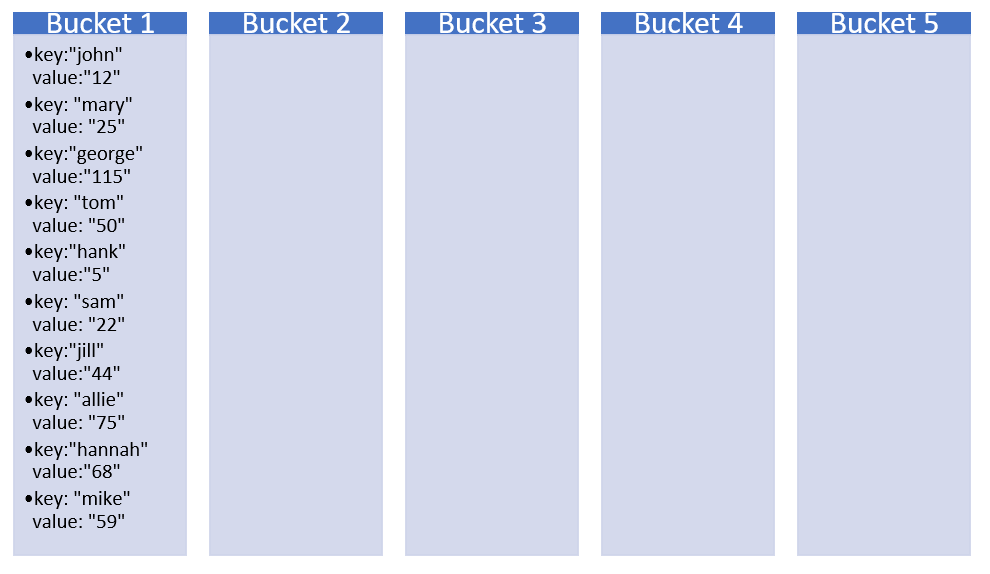

This tutorial will show you how to implement a hash table with **separate chaining**. It's not the most efficient method, but it is the simplest way to get started and create a fully functioning hash table.

<!-- more -->


## Background

Hash tables are indispensable tools for solving a wide assortment for so many interesting programming problems. I always love to incorporate a hash table into a problem; they can provide a clean solution to an issue that would be a mess otherwise.

For the longest time, I wondered how hash tables were created. I wanted to make my own, but I had no clue as to how they worked. Luckily, I found [James Routley's awesome post](https://github.com/jamesroutley/write-a-hash-table) detailing how to implement one in C. For anyone interested, I highly recommend it.

Using this knowledge, I ported the hash table to Python. By the end of this tutorial, you will understand the basic ideas behind the hash table. Perhaps more importantly,  you will have implemented your very own!

## The Basics

If you've ever used a dictionary in Python or an associative array in a language like PHP, You've probably used a hash table before. Features such as the dictionary in Python or the associative array in PHP are often implemented using a hash table. Even more straightforward is the HashTable class available in Java.

Why would we need such a structure? Well, sometimes a flat area just isn't enough. To make sense of the problem at hand, you may need to store and access your data by a **key**, a definite step up from the rudimentary integer index provided by flat arrays.

The hash table we build will be used like this:

```python
# Create a new HashTable
ht = HashTable()
# Create some data to be stored
phone_numbers = ["555-555-5555", "444-444-4444"]
# Insert our data under the key "phoneDirectory"
ht.insert("phoneDirectory", phone_numbers)
# Do whatever we need with the phone_numbers variable
phone_numbers = None
... # Later on...
# Retrieve the data we stored in the HashTable
phone_numbers = ht.find("phoneDirectory")
# find() retrieved our list object
# phone_numbers is now equal to ["555-555-5555", "444-444-4444"]
```

How does this really work under the hood? As it turns out, your key (`phoneDirectory` in this example) is converted into an index. This index is used for storing and retrieving the data value from the hash table's internal array. All those messy details are hidden from the user - they just have to worry about `insert()`, `find()`, and `remove()`.

## Fields

Our hash table will need a few fields to keep it together. It needs a `size`, which will be the number of elements that have been inserted. It needs a `capacity`, which will determine the size of our internal array. Last, it needs `buckets` - this is the internal array, storing each inserted value in a "bucket" based on the provided key.

```python
class HashTable:
	def __init__(self):
		self.capacity = INITIAL_CAPACITY
		self.size = 0
		self.buckets = [None] * self.capacity
```

Note the `INITIAL_CAPACITY` variable, arbitrarily set to 50 in my example class. This defines the size of our internal array. In a more complex hash table implementation (i.e. an open-addressed, double-hashed hash table), it's important that the capacity is prime, and that it can be changed. On the other hand, our separate chaining hash table sets the capacity once and never changes it, regardless of how many elements are stored. This is good for simplicity, but bad for scalability.

## HashTable Node

If you thought you were getting a break from the internal Node structure, you were wrong! Our hash table will need its own version of a Node:

```python
class Node:
    def __init__(self, key, value):
        self.key = key
        self.value = value
        self.next = None
```

Look familiar? Node has a `next` field because it's actually part of a [LinkedList](../linked-lists-in-python/index.md). Because the hash table uses **separate chaining**, each bucket will actually contain a LinkedList of nodes containing the objects stored at that index. This is one method of **collision resolution.**

## Collisions

Whenever two keys have the same hash value, it is considered a collision. What should our hash table do? If it just wrote the data into the location anyway, we would be losing the object that is already stored under a different key.

With separate chaining, we create a Linked List at each index of our `buckets` array, containing all keys for a given index. When we need to look up one of those items, we iterate the list until we find the Node matching the requested key.

There are other, far more efficient ways of handling collisions, but separate chaining is likely the simplest method.

## Methods

Now we can really get started. Let's jump into our hash table's methods.

### Hash

Our hash method needs to take our key, which will be a string of any length, and produce an index for our internal `buckets` array.

We will be creating a hash function to convert the string to an index. There are many properties of a good hash function, but for our purposes the most important characteristic for our function to have is **uniformity**. We want our hash values to be as evenly distributed among our buckets as possible, to take full advantage of each bucket and avoid collisions. The ideal case is pictured below:


<figcaption>HashTable Buckets with Uniform Distribution (good)</figcaption>

On the other hand, an uneven distribution will defeat the purpose of the hash table altogether, yielding nothing more than a bloated LinkedList.

Consider an extreme case: Our hash function will be `h(x) = 1`. That's right, each input produces the same constant value. So, what happens? Every time we hash a key, the output is 1, meaning that we assign that node to bucket 1. The result would look something like this:


<figcaption>HashTable Buckets with Non-Uniform Distribution (bad)</figcaption>

Not pretty! We'll just have to make sure we avoid this bottleneck at all costs.

Here's the code for our hash function:

```python
def hash(self, key):
	hashsum = 0
	# For each character in the key
	for idx, c in enumerate(key):
		# Add (index + length of key) ^ (current char code)
		hashsum += (idx + len(key)) ** ord(c)
		# Perform modulus to keep hashsum in range [0, self.capacity - 1]
		hashsum = hashsum % self.capacity
	return hashsum
```

While fairly arbitrary, this function will provide an acceptable degree of uniformity for our purposes.

### Insert

To insert a key/value pair into our hash table, we will follow these steps:

1. Increment size of hash table.

2. Compute `index` of key using hash function.

3. If the bucket at `index` is empty, create a new node and add it there.

4. Otherwise, a collision occurred: there is already a linked list of at least one node at this index. Iterate to the end of the list and add a new node there.

This is reflected in the following code:

```python
def insert(self, key, value):
	# 1. Increment size
	self.size += 1
	# 2. Compute index of key
	index = self.hash(key)
	# Go to the node corresponding to the hash
	node = self.buckets[index]
	# 3. If bucket is empty:
	if node is None:
		# Create node, add it, return
		self.buckets[index] = Node(key, value)
		return
	# 4. Collision! Iterate to the end of the linked list at provided index
	prev = node
	while node is not None:
		prev = node
		node = node.next
	# Add a new node at the end of the list with provided key/value
	prev.next = Node(key, value)
```

### Find

After storing data in our hash table, we will surely need to retrieve it at some point. To do this, we'll perform the following steps:

1. Compute the `index` for the provided key using the hash function.

2. Go to the bucket for that `index`.

3. Iterate the nodes in that linked list until the key is found, or the end of the list is reached.

4. Return the value of the found node, or None if not found.

This idea would be expressed in code like this:

```python
def find(self, key):
	# 1. Compute hash
	index = self.hash(key)
	# 2. Go to first node in list at bucket
	node = self.buckets[index]
	# 3. Traverse the linked list at this node
	while node is not None and node.key != key:
		node = node.next
	# 4. Now, node is the requested key/value pair or None
	if node is None:
		# Not found
		return None
	else:
		# Found - return the data value
		return node.value
```

### Remove

Removing an element from a hash table is similar to removing an element from a linked list. This method will return the data value removed, or None if the requested node was not found.

1. Compute hash for the key to determine `index`.

2. Iterate linked list of nodes. Continue until end of list or until key is found.

3. If the key is not found, return None.

4. Otherwise, remove the node from the linked list and return the node value.

This would be reflected in code as such:

```python
def remove(self, key):
	# 1. Compute hash
	index = self.hash(key)
	node = self.buckets[index]
	prev = None
	# 2. Iterate to the requested node
	while node is not None and node.key != key:
		prev = node
		node = node.next
	# Now, node is either the requested node or none
	if node is None:
		# 3. Key not found
		return None
	else:
		# 4. The key was found.
		self.size -= 1
		result = node.value
		# Delete this element in linked list
		if prev is None:
			node = None
		else:
			prev.next = prev.next.next
		# Return the deleted language
		return result
```

For more information about removing a node from a linked list, see my [LinkedList article](../linked-lists-in-python/index.md).

## Applications

Hash tables can be useful in a wide variety of computer science applications. Once you learn how to use them, you won't be able to stop! It seems at every turn there is a new application for the hash table.

Below are a few problems you can attempt to solve using your new hash table:

1. Write a function to determine whether a string contains repeated characters.

2. Given a string of any length, find the most-used character in the string.

3. Write a function to determine whether two strings are anagrams.

## Source

Thank you for reading. Check out the full source code for what we did today below!

**[Full HashTable source code](https://github.com/pagekeysolutions/education/blob/master/HashTable/hashtable.py)**

**[HashTable test code](https://github.com/pagekeysolutions/education/blob/master/HashTable/test_hashtable.py)**