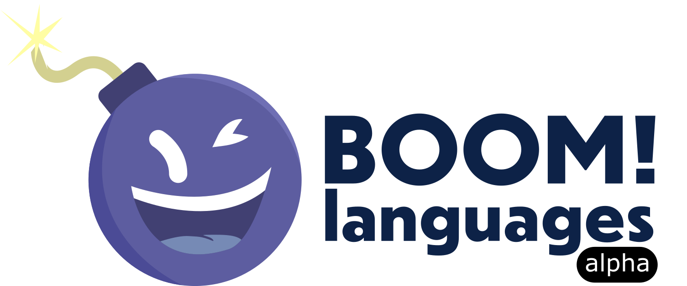
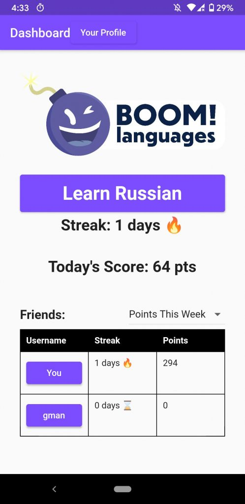
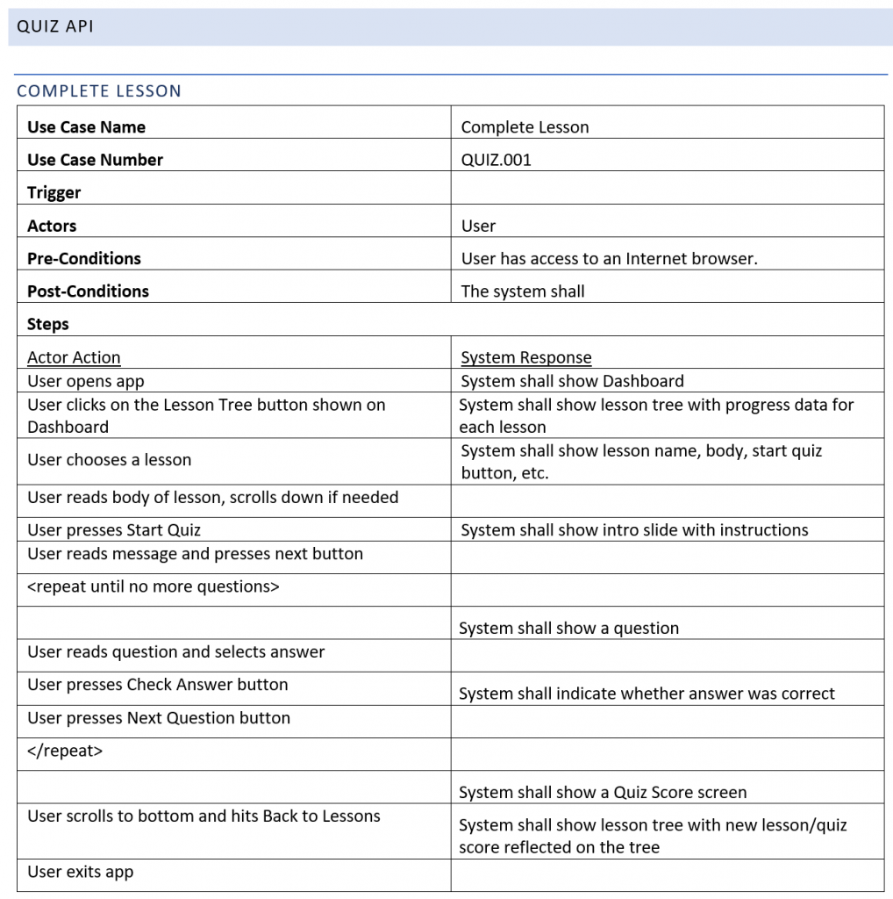
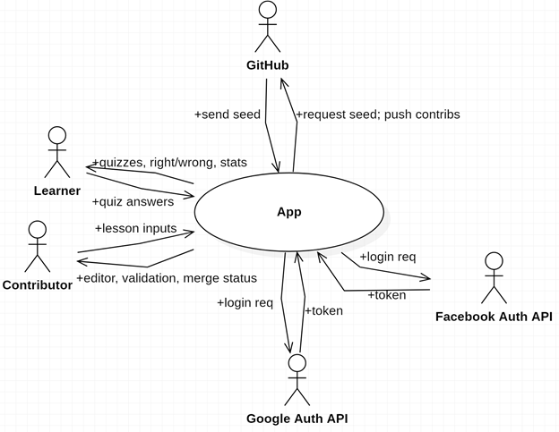
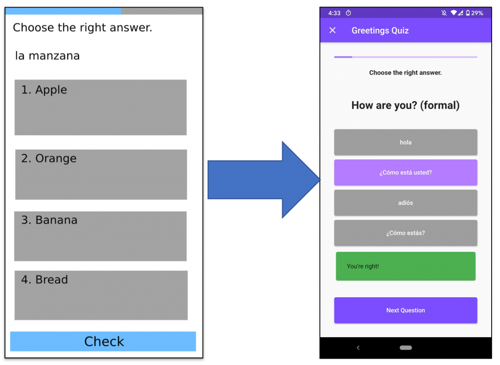
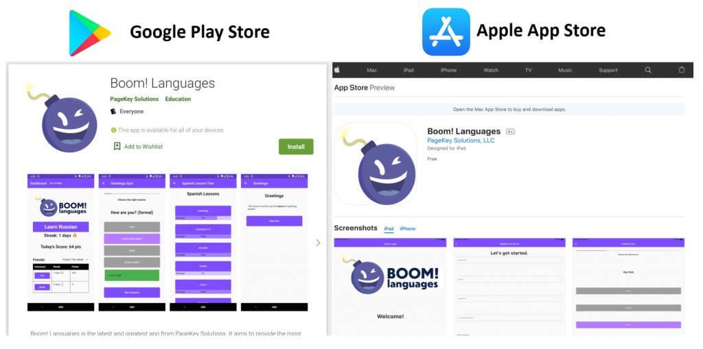

<figcaption>The Boom! Languages logo, created by Nick Fulfaro (<a href="https://instagram.com/fulfaroanimations">@fulfaroanimations</a>).</figcaption>

About four months ago, in late November 2020, I finally took action on an ambitious plan that I've had in the back of my head for quite a while. I wanted to build a language-learning app that was just a bit different than the others I've tried.

As with any project, it seemed easy... until I got started!

I created a plan, designed the app, and implemented it as best I could. While it has fewer features than I originally thought I'd be able to get done, the ones that it *does* have seem to work well so far (in spite of a few bugs people found immediately after it was published).

<!--truncate-->

## Try it now!

Boom! is available on Android and iOS. You can give it a try yourself!

So far, it's a really simple concept. Just create an account, select a language, and start taking quizzes! You'll get points for each lesson, and a streak if you maintain it for more than one day. As a bonus, you can add your friends and check in on their progress, too.

[Try Boom](https://boomlanguages.com)

The language data used for all of the quizzes is intentionally **publicly available** (more on this later). You can find links to this data inside the app, or check it out [here](https://gitlab.com/pagekeysolutions/boom). If you know one of the languages we're teaching (just Spanish, Russian, and French for now) and want to go above and beyond, feel free to create an issue and merge request on GitLab to add more lessons. I hope to add more soon, so if you have ideas, let me know!

For people who aren't familiar with how GitLab works, rest assured that I've realized the error in my ways - Git is not the best way for us all to collaborate. I'm working on an easier way to do this, so stay tuned!

<figcaption>The Boom! Dashboard in all its glory</figcaption>

## The Why

You can't browse the internet, watch TV, or listen to the radio anymore without hearing ads about language learning apps. Every company with a language app wants to convince you that **their** solution is the one that's different, the one that's finally going to make you fluent in your target language. Just come use **their** product and it will all work out!

I've been interested in learning languages as a hobby for quite a while, so I've tried my share of language learning software. I can remember the excitement I felt when I first got my hands on a copy of Rosetta Stone for Spanish from the local library back in sixth grade. It was a great start, but soon enough, I started looking around on the internet for more resources. I eventually started reading articles from people who had done what I wanted to do: become fluent in a foreign language of their choice.

As it turns out, one of the first things that they tell you on blogs and YouTube videos about language learning is that **you can't do just one thing to learn a language**; you have to try a ton of techniques, gleaning bits and pieces from the varied things you do along the way. The more distinct tactics that you try out, the better you'll learn.

In other words, these companies aren't being entirely honest when they sell their solution as **the one thing** that you need to learn a language.

Let's not forget how much time has passed since these products were first released. I'm not going to call out any specific product or company - I'll leave it as an exercise to you. Think of a language learning product, any of them. Now ask yourself a few questions.

**How long has it been around?** Good. Now, what's the main feature of the product? How does it keep you engaged? **When was the last time they added something radically new to switch up your learning, keep you engaged, and add another facet to your language repertoire?**

The answer to the last question is key. Chances are, it's been a while.

The stagnation I have observed is certainly understandable; I can't blame these companies for doing one thing and doing it well, nor can I knock them for making no more than tiny, incremental improvements for as long as it remains profitable.

But on the other hand, I see a need that is only being partially met. Language learners are forced to use more than one solution if they want to be successful. Those who realize this will try many things and, most likely, meet their goals - others may simply wonder in frustration why they're not progressing.

So here's the opportunity: if existing language companies are willing to remain comfortable and do one thing well, someone like me may be able to fill in the gaps for people who want more.

## The What (My Solution)

Let's take a step back. That was sounding pretty ambitious, even arrogant, for someone who doesn't even seem to have a plan yet. What's going to make this app so great?

To be fair, there are many, many obstacles that could get in the way of a single person trying to compete with well-established, well-funded companies that have existed for decades. But who knows? I may gain some allies along the way to help out. (Hit me up - <info@pagekeysolutions.com>)

If all goes well and I can get everything working, I would like Boom! to present **engaging quizzes** that **randomly generate content** to make people **use the vocabulary and grammar they learn in new ways**. I want this content to be **publicly available**, *and* **publicly editable** (though there will be a review process before edits are merged).

The idea is that if everyone can edit and freely download the language learning content, it will become a shared resource better than anything that was developed privately. Plus, there's no need for the next person to start from scratch. If someone were to use that same data to create a sleeker application that teaches people more efficiently, we all win.

I have a growing list of other features that will tie into the same system to provide novelty and (eventually) some semblance of virtual social interaction, keeping people on their toes and having fun as they learn. I haven't developed these ideas enough to share them yet, but hopefully I'll be able to add them to the app soon.

For now, my main focus has been getting the first iteration of reliable, engaging language quizzes up-and-running on people's phones. I'll share a bit of the process I followed in hopes that you'll glean something useful from it.

## The How

I'd divide what I've done up to this point into management and technical discussions.

### Project and Time Management

Though it's something I once gave little thought to, I've come to realize that project management, design, and organization are some of the most important considerations when you want to make something happen.

Thanks to the advice of my friend [Daniela Gil](https://www.linkedin.com/in/daniela-gil-016532104), who is a management maven, I was able to plan almost all of the activities that I needed to complete for this app before starting any work, including tasks like getting the server up, registering the app in the store, and even creating my own business to more easily manage the financial side of things. Of course, the central task was writing the code, which I did my best to break down as well.

Using a Work Breakdown Structure (WBS) from the very start had two benefits: first, it gave me motivation, because I could see a clear path to what I wanted to do, and second, it kept me from getting distracted, going down the rabbit hole, and ultimately not finishing the project.

### Technical Design

Another helpful resource that I stumbled upon just-in-time was my Foundations of Software Engineering course that I'm taking at the [Whiting School of Engineering at Johns Hopkins University](https://engineering.jhu.edu/). The Foundations of Software Engineering course gave me all the tools that I needed to think through writing an application, from start to finish. I'm thankful for my professors, Sam Schappelle, Joe Demasco, and Jeff Garonzik, for providing an informative, practical course.

The course stressed the need to have discipline and avoid the "code and fix" design pattern. I was determined to embody this value, aiming to create a design that was as detailed as possible before writing any code!

<figcaption>Becoming clear on the Use Cases was one of the first design steps I took. It informed nearly all activities that followed. Looks like I got distracted while writing the post-condition, though.</figcaption>

It paid off, too. The upfront design gave me clarity and saved me many hours (of which I have precious few to spare for this type of project). Instead of coding in circles without really thinking about what I was doing, the design facilitated a focused, modular implementation. It was kind of like I was my own boss, at first considering only the high-level design of the app without touching any code. It was this restraint that kept my code-junky fingers from digging this project into a hole it would never get out of.

Many of essential questions were answered using tactics cleaned from my Software Engineering class (and a few systems engineering courses). Especially handy were creating the context diagram, carefully defining use cases, making wireframes, and constructing a data model.

<figcaption>An early attempt at an all-inclusive Context Diagram. I never got around to letting people login with Google or Facebook. I also switched from GitHub to GitLab.</figcaption>

### User Interface

From the start, I knew that I needed a client and a server to get this job done. I already had a tech stack in mind, too, thanks to a few prototypes I threw together for fun. My plan was to use Flutter for the frontend, and Ruby on Rails for the backend.

In case you haven't heard of it, [Flutter](https://flutter.dev/) is an open-source UI framework developed by Google that allows you to write code once and publish it on iOS, Android, Web, and even Desktop! (though Desktop is still in beta.)

It uses a brand new programming language called Dart that was specially built to work well with Flutter (as far as I know). It's a lot like Java, but with a lot less annoying boilerplate code to write, and with much better support for asynchronous programming. I was a bit jarred at first by the use of Futures, async functions, and their anonymous function syntax (one-liner is `() => Statement()`, multi-liner is `() => {<block here>}`). Once I got used to it, though, everything started to fit together very, very nicely.

I've had some exposure to asynchronous programming through tinkering with Node.js, but I recall leaving it behind in frustration when I noticed that all of my programs tended to turn into an endless pit of nested functions as complexity increased.

I didn't really have that problem with Dart. Maybe it's because of the strong typing and similarity to Java, or maybe it's just because I stuck with it a bit longer and read up more on the way to do things properly (instead of forging ahead and trying to do things my way, which may have been part of the problem with my Node.js adventures 🙂).

I want to give a shout-out to [Nick Clark](https://github.com/nickclark2016), who introduced me to Flutter for the first time last summer when we were on a project at work together. Though we didn't end up using Flutter in our final product, it gave me some initial exposure to it, which allowed me to dive much deeper in this project. Nick, you must really have your ear to the ground, because this was an excellent find.

<figcaption>Each screen in the app began as a wireframe (left). Through many small tweaks, these rough ideas morphed into an actual user interface (right).</figcaption>

### Backend

I used an API-only Ruby-on-Rails application for the backend. I hosted it on my own server in the cloud.

The upfront design of use cases allowed me to use **Test Driven Development (TDD)** for almost all of the code I wrote on the backend.

I was very strict at first, making myself write the failing test before actually touching any implementation code. As I neared the end, I loosened up a bit, skipping a few functions here and there that were particularly hard to test. For the most part though, any code changes began by writing or changing tests. This gave me much more confidence when making any sorts of changes, and seemed to result in a fairly robust result.

From what I read online, using a strongly typed language might have significantly cut down on the number of tests that I needed to write. However, until they come up with [Rails for Rust](https://users.rust-lang.org/t/something-like-ruby-on-rails-for-rust/45125) or something like that, I'm sticking with Rails because it works great.

<figcaption>Nothing like testing your entire server-side with just 5 keystrokes!</figcaption>

## Successes

My biggest success so far for this project is that **it is done**, I [shipped it](https://alexarohn.com/shipping-for-the-uninitiated/), it's out the door! Too many of my past ideas have turned into messy prototypes that I shoved into a digital drawer, never again to see the light of day. And those are the times that I've actually gotten to the code-writing stage; I've had tons of app ideas that I never took action on.

Overall, most of these projects were never finished due to lack of clarity, lack of interest, or getting stumped on some technical details. The upfront design of Boom! played a huge part in mitigating these issues.

The first version of this app isn't particularly mind-blowing, but it does work. For now, that's good enough!

<figcaption>The only thing that's missing is a way to access it from a browser. Coming soon!</figcaption>

## Lessons Learned

It's a lot harder to reach back and remember the lessons learned when I haven't been keeping notes to that effect. So, the first lesson learned is to keep notes and **write things up as you go!**

The second takeaway I had was to **respect the non-technical details**. If I had a specific date to complete this app, I surely would have been derailed by the unplanned hours I had to spend making accounts, starting a business, and jumping through hoops for the Apple Developer program, among other things. There were many, many extra steps to these tasks that I didn't anticipate. Luckily, I was on a completely self-imposed schedule, so a few extra days getting the app to market didn't really cost anything.

**Design first pays off.** As mentioned above, carefully considering the design upfront, before starting any coding, was a huge boon to getting this put together on time with only a few hiccups along the way.

**Git is for software developers.** I originally thought that having everyone contribute to a single Git repository of language data was the perfect solution. You get line-by-line diffing, you can see exactly **who** contributed **what** and exactly **when** they did it, and you can use branches to work on lessons that aren't ready for the main app yet. However, Git is not easy to jump into if you have no experience with it. While the Git workflow for managing source code works incredibly well, it's *not* a great tool for allowing *people who don't code* to collaborate. Down the line, I'd like to scrap the current Git-based contribution design in favor of a fully integrated in-app workflow.

I'm still disappointed, though, because I keep wanting to apply Git's effortless beauty to new things. It sounded like a great idea to use Git to manage the open-source language data, but for any linguists with no software experience who may want to contribute, it's a pretty steep learning curve.

Currently, the language data is written **by hand** (using a code editor) into a single JSON file, `dataset.json`, and there is code on the Rails side to ingest this file and insert the appropriate records into the DB to match the JSON file's structure. The downsides of this became clear immediately: the JSON file is hard to edit, it's easy to make mistakes, and worst, I have to dump the previous "language data set" in favor of the new one, even if it's a tiny change. Currently, this clears any "memory" the app had of which lessons you completed, which is a huge design flaw. I could get around this by including an ID for everything in `dataset.json`, but that would make it even harder to edit.

In the future, I want to go in the other direction; the app will store the most up-to-date copy of all language data in the database, and the data will remain publicly available by way of an Export-As feature. This is more flexible - download it as JSON, sure, but maybe you prefer CSV, or even something wacky like PowerPoint! Anything is possible at that point, since all of the data is readily accessible in the database, where it can be easily ingested by scripts. It will also be fairly easy to back up the data - I better not forget that part!

## Next Steps

I am going to take a break from this project. I'm in grad school, and there's not much time to work on things like this during the semester. I may pick it up again during the summer.

As I mentioned above, the next major update I'll focus on will be to add a way to contribute new language data from within the app.

A small change I may make soon is to add a little "alpha" tag to the logo, to indicate that the app is in a very early stage of development and may have issues (or just lack features).

Monetization would be nice, but realistically, I'd probably need thousands of users to make it worthwhile, which I don't think will be possible until it's a bit higher quality. For now, I'd rather focus on improving what I already have.

Transparency about monetization and how it is done would be a great goal. It's well known that "if it's free, you're the product." But the application that is making money off of showing you ads or something of that nature rarely explicitly spells it out.

I feel that **if something involves using people's *attention*, which is an increasingly valuable, and *scarce*, resource in our world**, then we should make it abundantly clear what is happening. Apps that use addictive techniques to waste our time viewing ads for their profit are potentially stealing moments from people's lives that could be used to interact with people that they love or to advance society with meaningful work. It's not necessarily bad if the app serves a good purpose, such as education, but we still have to acknowledge that we have something to gain from drawing people in.

That being said, maybe I'm a bit of a hypocrite for engaging in such a system, but at least I'm being open about it! Do you have ideas for better business models for the internet? Let me know!

## Get Involved

You made it all the way to the end? Thanks for that!

Please [download the app](https://boomlanguages.com/) and try it out if you haven't already. I am very open to feedback and ideas for new features. Just send your thoughts over to <info@pagekeysolutions.com>.

Also, if you want to read more tech articles like this, consider subscribing to our Line by Line Code mailing list using the form below this article.