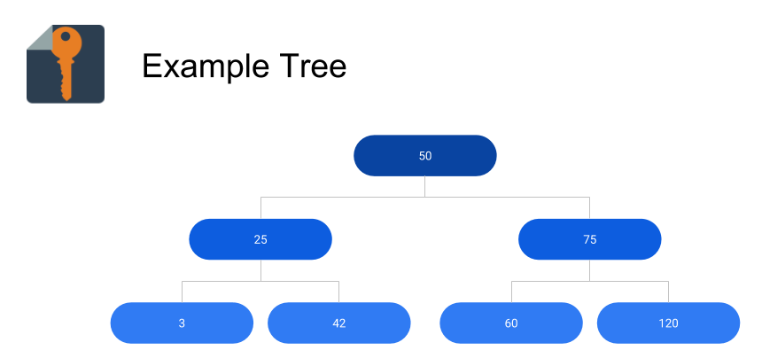
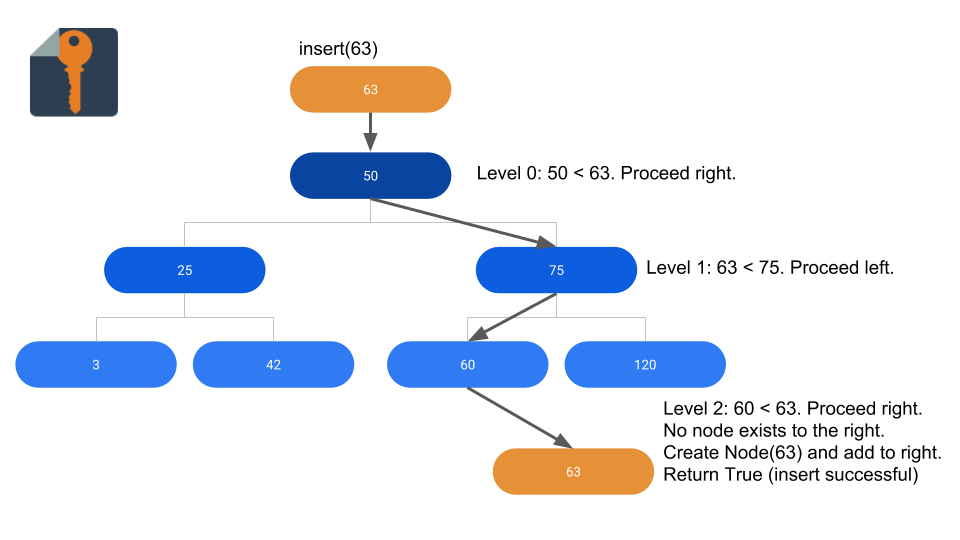
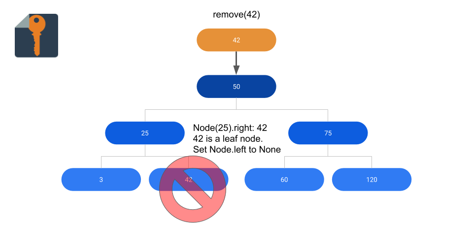
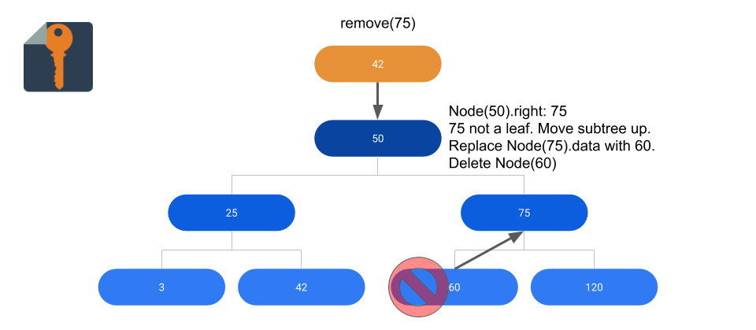
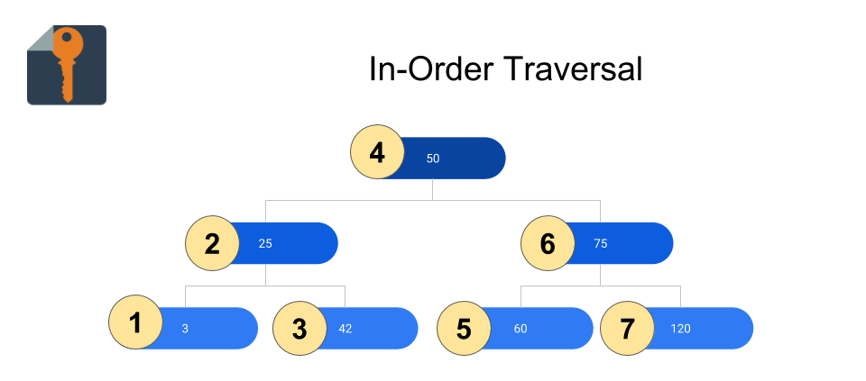

Decisions, decisions... Life is all about choices! Usually there are so many ways to go. An infinite expanse of roads and pathways stretches in front of you, an endless gradient of details; as you consider them, your head starts to spin, your eyes start to droop, your mind races, your head pounds -

Wait a second. There's no need to stress. Since we're talking about Binary Search Trees, decisions are going to be a lot easier. A Binary Search Tree (BST) gives you two choices: left or right, less than or greater than, 0 or 1 - hence the name, **binary**.

<!--truncate-->

## Overview

A BST is a great choice for storing data that may need to be sorted. Anything that is stored in a BST must be **comparable**, which means that the data can be compared with less than `<`, greater than `>`, and equal to `==` operators.

For flat arrays, searching for, inserting, and deleting data will loop through every single element, yielding an average efficiency of `O(n)`. With a Binary Search Tree, each step down the tree cuts the remaining nodes to search by up to half. For this reason, **search on a BST is performed in `O(log(n))` time on average**. This is a significant improvement, especially for large data sets.

## Insert



In this case, the `Node` will have most of the important code for the `insert` method. The `BST` class will essentially be a wrapper for the `Node`, hiding some of the rough edges of the internal methods to give the user a clean interface.

For the `Node`, our code will look like this:

```python
class Node(object):
  ...
	def insert(self, d):
		if self.data == d:
			return False
		elif d < self.data:
			if self.left:
				return self.left.insert(d)
			else:
				self.left = Node(d)
				return True
		else:
			if self.right:
				return self.right.insert(d)
			else:
				self.right = Node(d)
				return True
  ...
```

The above code first checks if the data object already exists in the tree. If it does, it returns `False`, indicating that no node was inserted. Otherwise, it will go to the left or right depending on whether the data to insert is greater or smaller than the node's value. If there's nothing on the side that is chosen, a new node is created, and we return `True`. Otherwise, the method continues recursively, checking and moving left or right until the data is found or inserted in the tree.

The `BST` class will wrap this neatly, beginning the recursive call on the root node like so:

```python
class BST(object):
  ...
	def insert(self, d):
    '''
    returns True if successfully inserted, false if exists
    '''
		if self.root:
			return self.root.insert(d)
		else:
			self.root = Node(d)
			return True
  ...
```

## Find


`find` is another recursive method, which means that it will be implemented in the `Node` class.

```python
class Node(object):
  ...
  def find(self, d):
    if self.data == d:
      return True
    elif d < self.data and self.left:
      return self.left.find(d)
    elif d > self.data and self.right:
      return self.right.find(d)
    return False
  ...
```

In the above code snippet, we first check for the best case - did we find what we are looking for? If so, we are done and can tell everyone the good news by returning `True`.

Otherwise, we have to check which way to go. If the data is less than the current node, we move left. Otherwise, we move right. However, to move left or right, there has to be something there. If not, we're just going to call it quits and return `False`.

The BST wrapper will shape up like this:

```python
class BST(object):
  ...
  def find(self, d):
    '''
    Returns True if d is found in tree, false otherwise
    '''
    if self.root:
      return self.root.find(d)
    else:
      return False
  ...
```

## Remove


<figcaption>Example of leaf node removale</figcaption>


<figcaption>Example of non-leaf node removal</figcaption>

Finally, the `BST` class is getting its chance to be more than just a wrapper! The `Node` class will have no `remove` method at all - the magic will happen entirely within the `BST` class.

While most of these methods can be explained in a fairly straightforward way, `remove` is where I draw the line. For some reason, this code is ridiculously complicated, and it's best to just bite the bullet and break it down into a set of well-defined cases.

```python
class BST(object):
  ...
  def remove(self, d):
    '''
    Returns True if node successfully removed, False if not removed
    '''
    # Case 1: Empty Tree?
    if self.root == None:
      return False

    # Case 2: Deleting root node
    if self.root.data == d:
      # Case 2.1: Root node has no children
      if self.root.left is None and self.root.right is None:
        self.root = None
        return True
      # Case 2.2: Root node has left child
      elif self.root.left and self.root.right is None:
        self.root = self.root.left
        return True
      # Case 2.3: Root node has right child
      elif self.root.left is None and self.root.right:
        self.root = self.root.right
        return True
      # Case 2.4: Root node has two children
      else:
        moveNode = self.root.right
        moveNodeParent = None
        while moveNode.left:
          moveNodeParent = moveNode
          moveNode = moveNode.left
        self.root.data = moveNode.data
        if moveNode.data < moveNodeParent.data:
          moveNodeParent.left = None
        else:
          moveNodeParent.right = None
        return True		
    # Find node to remove
    parent = None
    node = self.root
    while node and node.data != d:
      parent = node
      if d < node.data:
        node = node.left
      elif d > node.data:
        node = node.right
    # Case 3: Node not found
    if node == None or node.data != d:
      return False
    # Case 4: Node has no children
    elif node.left is None and node.right is None:
      if d < parent.data:
        parent.left = None
      else:
        parent.right = None
      return True
    # Case 5: Node has left child only
    elif node.left and node.right is None:
      if d < parent.data:
        parent.left = node.left
      else:
        parent.right = node.left
      return True
    # Case 6: Node has right child only
    elif node.left is None and node.right:
      if d < parent.data:
        parent.left = node.right
      else:
        parent.right = node.right
      return True
    # Case 7: Node has left and right child
    else:
      moveNodeParent = node
      moveNode = node.right
      while moveNode.left:
        moveNodeParent = moveNode
        moveNode = moveNode.left
      node.data = moveNode.data
      if moveNode.right:
        if moveNode.data < moveNodeParent.data:
          moveNodeParent.left = moveNode.right
        else:
          moveNodeParent.right = moveNode.right
      else:
        if moveNode.data < moveNodeParent.data:
          moveNodeParent.left = None
        else:
          moveNodeParent.right = None
      return True
  ...
```

Whew! Glad that one's done.

## Traversals

There are three ways to traverse a tree: pre-order traversal, in-order traversal, and post-order traversal. The traversals are mostly implemented in the `Node` class.

We mentioned at the start of the article that BSTs can be useful for sorting data. As it turns out, the way in which you **traverse** the tree structure will yield different element orderings that can be applied to a variety of applications.

The most straightforward example is sorting from least to greatest. If your BST contains all numbers, **an in-order traversal of the tree will return a list of all the numbers in the tree, sorted.** Another application is the conversion of expressions between infix, prefix, and postfix. If you can represent an expression as an Abstract Syntax Tree (AST) or something similar, these conversions can be performed with an in-order, pre-order, or post-order traversal of the tree.

The code for each method of traversal will look very similar. Each time, we'll simply change where we make our recursive call.

### Pre-Order Traversal


```python
class Node(object):
    ...
    def preorder(self, l):
      '''
      l: the list of data objects so far in the traversal
      '''
      l.append(self.data)
      if self.left:
          self.left.preorder(l)
      if self.right:
          self.right.preorder(l)
      return l
    ...
```

### In-Order Traversal



```python
class Node(object):
    ...
    def inorder(self, l):
      '''
      l: the list of data objects so far in the traversal
      '''
      if self.left:
          self.left.preorder(l)
      l.append(self.data)
      if self.right:
          self.right.preorder(l)
      return l
    ...
```

### Post-Order Traversal


```python
class Node(object):
    ...
    def postorder(self, l):
      '''
      l: the list of data objects so far in the traversal
      '''
      if self.left:
          self.left.preorder(l)
      if self.right:
          self.right.preorder(l)
      l.append(self.data)
      return l
    ...
```

For each traversal, I added a corresponding wrapper in the BST class to expose it:

```python
class BST(object):
  def preorder(self):
    '''
    Returns list of data elements resulting from preorder tree traversal
    '''
    if self.root:
      return self.root.preorder([])
    else:
      return []
  def postorder(self):
    '''
    Returns list of post-order elements
    '''
    if self.root:
      return self.root.postorder([])
    else:
      return []
  def inorder(self):
    '''
    Returns list of in-order elements
    '''
    if self.root:
      return self.root.inorder([])
    else:
      return []
```

## Full Source and Tests

Thank you for reading. Check out the full source code for what we did today below!

**[Full BST source code](https://github.com/pagekeysolutions/education/blob/master/BST/bst.py)**

**[BST test code](https://github.com/pagekeysolutions/education/blob/master/BST/test_bst.py)**
