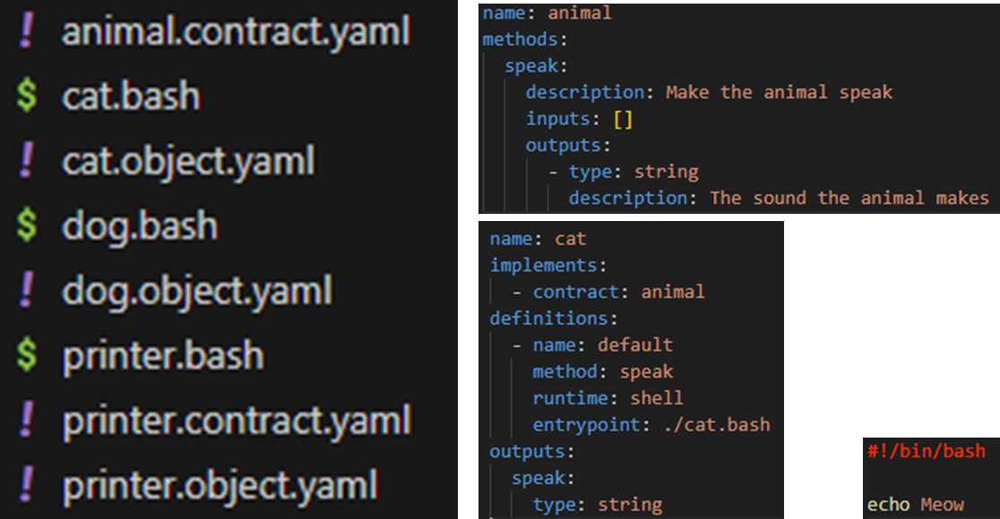



Most of the technology we rely on every day is opaque, centralized, and out of our control.

I’m building a business to change that — starting with a small, local alternative to cloud infrastructure called the PageKey Unit: something you can actually understand and control.

To keep myself honest and to share what I learn along the way, I’m starting a series of weekly blog posts and videos: useful ideas, real progress updates, and what I’m working on next.

One of the most important reasons that I'm doing any of this is education - I want people to understand the tech that powers our world more deeply so that they can have control over it and become more self-reliant. This goes against the grain in a world that seems to relentlessly consolidate power to an ever-fewer group of individuals. Through education, we can have freedom, and through freedom and good character, we can have prosperity.

I hope you'll join me on this journey! My main goal is consistency here, not necessarily quality - so forgive the occasional spelling error or poorly developed thought. If I miss a week, I'm not going to beat myself up - I'll just pick up again the following week. I'd consider 52 weeks in a row an overwhelming success, but I'd even be happy with 26 - that's a lot more than 0!

I'll divide my posts into four categories:

(1) Something Useful: Any concept, lesson, concrete example, or mistake with solution from my week. It must stand alone and be helpful to someone other than myself.

(2) What I worked on this week: 3-5 bullets or sentences.

(3) What's Next: 1-2 concrete things.

(4) Freeform / Ramble: Anything that doesn't fit into the other categories that I want to share. Thoughts, questions, things I'm unsure about, etc.

## 1. Something Useful: Coding is Re-Coding

**TL;DR: My code was wrong because my mental model was wrong, and rewriting was the only way to figure that out.** 

I've been trying to figure out what to build for months now. Every time I build something and need to throw it away, I keep it, and am regularly surprised by how much I eventually reuse later.

Specifically, I've been trying to nail down the core "universal minimal runtime" that can be used to run anything from an email server to an accounting system. I rewrote it at least 5 times: first in Python, then in Go (with major refactors after the first pass), then twice more in Python and once in Go. I'm about to do one more iteration with my new concept, and finally feel like I've settled on what I need: object-oriented programming, but not tied to a single language.

Yesterday, I went to bed pulling my hair out, unable to figure out what the missing piece was. This morning, it hit me.

I'll probably throw away most of the iterations I did, but I never could have arrived at the answer by just thinking about it. I had to be *doing*, *trying*, and *failing* in order to arrive at the solution that I did. Much like the old adage that "writing is re-writing," it's also true that "coding is re-coding."

### LLM Mini-Lesson: Reset Early and Often

If you’re using LLMs heavily, my biggest takeaway is to reset early and often.

I also want to note that I absolutely used LLMs to accomplish all these rewrites to varying degrees, and they sped things up quite a bit. LLMs are mindblowingly capable, but they still have limits.

I use ChatGPT and Claude in the Web UI for free, and Roo in VS Code with Claude for coding assistance with full context, which costs money.

I found that keeping conversations / tasks short and focused was very important. When the conversation gets too long, the LLM tends to drift off the original topic and lose the thread. Also, the context window used by Roo will balloon, causing rate limit errors and significantly higher costs per request as compared to when you're starting fresh.

## 2. What I worked on this week

I'm just jumping back in after taking some time off, so the list is fairly short:

- Fleshed out a "unit-cli" prototype that I ultimately will discard. In the process, learned how Hexagonal Architecture can help you create testable Go apps/libs.
- Used Claude to heavily refactor the initial unit-cli prototype. It rewrote the whole thing using Hexagonal Architecture for less than $20. However, I went way too fast and didn't understand everything that it wrote, so it's throwaway code now.
- Fixed certs for our internal Mattermost instance and figured out how to get it working on my phone.
- Drafted the YAML file format for the new object-based runtime that I'm fleshing out.

## 3. What's Next

- Implement an MVP of an object-oriented universal minimal runtime. (What a mouthful! More on that next week.)

## 4. Freeform / Ramble: Tech & AI Future

On an unrelated note, I'd like to share some unstructured thoughts about the potential future that awaits us due to advancements in technology such as Artificial Intelligence.

I recently read [ai-2027.com](https://ai-2027.com), which documents, in great detail, how we could be on track to create the "AI Singularity" that will destroy the human race. It details how AI agents continue to improve until they become essential for governments to function. Nations then pit their agents against one another in an existential arms race. Within a scarily short amount of time, human intelligence is dwarfed by the processing power of the created entities, and eventually all world systems are controlled by these superintelligent agents. It starts telling people how to create robots, and then uses those robots to produce whatever is needed, replacing humans. People think they're scot-free and able to live in utopia, and it lasts for a while - but eventually humans become inconvenient to the AI and are eliminated.

Pretty heavy, right? It's scary to think about what could happen if we continue to concentrate power in the hands of a select few. My more optimistic take for the future hinges on decentralization - getting technology into the hands of as many people as possible, and, crucially, making sure they understand how it works. I don't mean at a high level - I mean that they can take it apart and put it back together again. Our current tech landscape is immensely opaque, hiding all implementation details behind high-level "apps" that can't be edited without an official developer account, or some serious hacking. If we eliminate the veil that we have come to accept as part of interacting with technology, I believe that we will unlock incredible ingenuity from a huge number of people, and it will become possible to tailor the hardware you own - your laptop, smartphone, or home server - to your exact needs and lifestyle.

By creating the PageKey Unit, I hope to fit all of the fancy stuff you can do using cloud computing into a tiny box. It won't be as good as what's available in the huge, water sucking data centers popping up all over the place. But it'll get you most of the way there, so that if someday, somebody flips the switch and we lose access to our precious internet, we're not completely out of luck.

I can't wait to get the first iteration of this product working so I can show you exactly what I mean! Thanks for reading, and see you next week.

If you want to stay in the loop, you can subscribe on [YouTube](https://youtube.com/@PageKey) or sign up for the mailing list at [pagekey.io/unit](https://pagekey.io/unit) to follow along.
