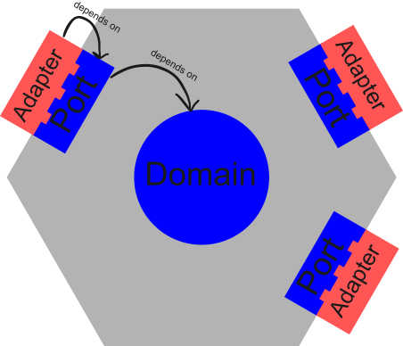



Welcome back! This is PageKey, where we Take Back Tech. Here's something useful:

## 1. Something Useful: Hexagonal Architecture (What, Why, and How)

**TL;DR: Hexagonal Architecture separates business logic from implementation, making systems flexible and extensible.** 

### What?

Most developers learn about design patterns, such as [Strategy](https://refactoring.guru/design-patterns/strategy), [Adapter](https://refactoring.guru/design-patterns/adapter), [Factory](https://refactoring.guru/design-patterns/abstract-factory), or [Observer](https://refactoring.guru/design-patterns/observer) - tools for structuring individual components. Hexagonal Architecture operates one level higher; it's a system-level design pattern. Along with Clean Architecture and Onion Architecture, it's a way to apply SOLID principles to the overall shape of an application or software system.

Hexagonal Architecture (aka "Ports and Adapters") splits an application into three parts:

- **Domain**: Core business logic.
- **Ports**: Abstract interfaces that define what the domain can do (in-ports) and what it needs to get the job done (out-ports).
- **Adapters**: Concrete implementations that connect the domain to the outside world.

The key idea is that the domain sits at the center and knows nothing about the specifics of how things get done - just the high-level logic. Everything else adapts to and depends on the domain (and not the other way around).

For example, if your in-port is "Send an email", the domain may require two out-ports: `MessageSender` and `MessageLog`. With these, the domain can enforce a business rule like "every attempted send must be recorded."

Whether `MessageSender` is implemented using SMTP, an AWS API, or something else entirely doesn't affect the core logic. Given the inputs, the domain sends the message and logs the result.

Similarly, logging implementation is an infrastructure detail. It doesn't matter whether you write to a file, push to Grafana, or post events to ElasticSearch. The domain doesn't care - it depends only on the contract (ports), not the implementation (adapters).

### Why?

The adapters change more often than business logic.

If you use Hexagonal Architecture, you can:

- Swap the database, API backend, or UI used by your app without touching core logic.
- Keep business rules readable and testable.
- Avoid locking in specific frameworks or vendors.

Stable code lives at the core; volatile code is at the edge, where it can be easily swapped out when things change.

### How?

Whether you're starting a fresh project or refactoring an existing one, the rough steps remain the same:

1. **Define the domain.**

Model use cases using simple data structures and logic.

2. **Define ports.**

Create interfaces for:

  - *In-ports*: what the application can do (for the user).
  - *Out-ports*: what the application needs to do its job.

3. **Test the domain.**

Use TDD to unit-test your use cases with simple, in-memory adapters.

4. **Implement the (real) adapters.**

Write concrete, useful adapters for database, filesystem, HTTP, or CLI use cases that implement your application's ports. These may need to be integration-tested or moved to a separate package depending on the amount of complexity. The adapters are messy so that the domain can be clean!

5. **Add composition root.**

A CLI, service, or job runner serves as the composition root. It wires everything together and starts the app. The composition root, like any other adapter, depends on the domain (not the other way around).

Remember this rule: **dependencies always point inward** (toward the domain).

- Adapters depend on external libraries and ports.
- Ports depend on the domain.
- The domain depends on nothing.

If you can pull this off, you'll end up with a system that's easy to reason about, test, and change.

### Tangent: Off-Grid Finance

> **Disclaimer:** I'm not an economist, I'm a computer guy - so take this with a grain of salt!

Have you ever wondered what would happen if your town decided to form its own economy, separate from the rest of the world? I mean no banks, no Amazon, no supply chains, and no US dollar.

While this may seem like a finance topic, it’s actually a lens for thinking about decentralized systems (one of our favorite topics at PageKey).

If you dig deep enough, the problem is not about money, but coordination. Everyone needs a way of knowing who did what, who owes whom, and what to do if people disagree.

Economies are complicated - how can we simplify them? At its core, it seems an economy really only needs two things:

1. **Shared state**: How much money is in each person's account?

2. **Agreed-upon state changes**: Rules for exchanging goods and services.

There are many ways to accomplish this. The simplest is a **shared ledger**. In the past, this may have been a paper posted in the town square. Today, it could be a spreadsheet, database, or even an email thread. The important thing is that everyone can see the same history, and they can use it to agree about which changes are considered valid transactions.

What if there was an off-grid society using a self-hosted Bitcoin as its currency? I used to think this was a great idea, but after digging deeper, it seems impractical. Bitcoin is optimized for near-zero trust. It assumes users don't know or trust each other. Social trust is replaced with computation. A small off-grid community has the opposite problem: high-trust, but may have limited access to energy and computer hardware.

An interesting question to ask about an economy is, what constrains it? For a small group of people bartering for goods, the constraint is human memory. For example, if I give you an armload of logs, we both have to remember I did that long enough for me to ask you for some eggs in return when I need them. It works for two or three people, but beyond that, the complexity gets out of control!

If you upgrade to a shared ledger, the constraint becomes the effort required to maintain it. Every time someone buys or sells something, you'd have to write it down *and* get someone to witness the transaction. It's definitely doable for small groups, but requires time investment. In other words, a ledger shifts the burden from remembering correctly to following the right process.

For Bitcoin, the constraint is compute power and collective agreement about the transaction.

Thinking through this problem made me appreciate how easy everyday transactions are. Where I live, everyone accepts USD, and settling the transaction is someone else's problem.

While researching this topic, I started learning about the Federal Reserve, its relation to the US Dollar, and how it manages inflation. As you can imagine, it's a pretty deep rabbit hole - one for another day! For now, my takeaway is simple: if we learn about how the systems we use every day work (and help others understand, too), we can improve them and make life better for everyone. With this, we can stop treating these systems like magic, and start treating them like tools - tools that we must use responsibly!

## 2. What I worked on this week

- Created a Python prototype of Hex, the universal object runtime.
- Sketched out file-store and container apps for Hex.
- Wrote/recorded this post/video.

## 3. What's Next

- Solidify test cases for Hex Python MVP.
- Re-implement Hex Python MVP in Golang, using same integration tests.
- Integrate Hex into existing PageKey Unit services.
- Re-write Unit apps to use Hex (Website, App Manager).
- Demo Unit MVP using Hex!

## 4. Freeform / Ramble

Here are a bunch of random thoughts that don't fit anywhere else.

### Introducing: PageKey Hex

I've started implementing PageKey Hex, which is intended to be a universal object runtime. Think of it as an explicit, inspectable way of gluing small pieces of logic together.

What do I mean by this? Many programming languages have ways to build conceptual "objects". I want to take it a step further and define useful objects using nothing but config files and code snippets. These objects can invoke other objects, resulting in a fully transparent system. Users can edit any part of it just by tweaking the config files or code snippets.

This will likely have a performance tradeoff, but part of the bet I'm making with the PageKey Unit is that while datacenters and Big Tech companies need to optimize to handle billions of requests per day, the average user running their private cloud can get by with some inefficiencies. I'm pushing heavily in the direction of "clear and understandable, but inefficient." I think that the clear, understandable, inefficient tools can eventually be used to copy all of the right files into the right places to compile more efficient programs, but in a well-documented way!

That leads us to Hex. If we're going to have all these code snippets and YAML files floating around, we need a way to run them. Hex is just that - a command-line tool that allows you to run processes defined as YAML files.

I intend this to eventually be open-source. The PageKey Unit will integrate this tool with lots of other stuff, like user management, software updates, and an app store.

### On Mindset

I've been trying to avoid giving away so much that someone can scoop up my ideas and start the exact same business, undercutting me and torching my chances of success. However, whenever I lean too hard in this direction, I find that all my motivation is sapped. I believe this is because the whole point of this business is to increase education and transparency in the world. It's a little hypocritical of me to build in a vacuum without sharing what I've learned. When I do this, how can I expect people to trust me to help them run their lives on transparent technology?

The thing I need to keep reminding myself is that even if someone does try to steal what I've done so far, it's a net win for the world, because regardless of whether I build it or someone else does, we need better, more transparent technology to run our lives!

### Fate of the PageKey Unit

World events are causing the price of mini-PCs to skyrocket. I had hoped that the PageKey Unit would be a low-cost computer that anyone can buy a bunch of. It's starting to seem like it would make more sense to start with a higher-end product and work my way back to low-cost computing for everyone. Tesla followed this strategy.

Currently, the Unit is just a mini-PC that I re-brand and enhance with special software. Eventually, I could see it morphing into a range of products, each with a Bill of Materials that clearly shows where each part came from and other supply chain info that is typically hidden from your average consumer.

By providing the BOM, we can find the hard-to-replace bits of the supply chain and find ways to build them ourselves. This will result in each of us being more informed, feeling more empowered, and hopefully having more autonomy to do good things!

Regardless, the Unit will be designed for users who own their machine, not rent their software. Let's usher out the cloud era and start the golden age of self-hosting!

### Initial Applications

What will this thing do anyway? Here are the first use cases I envision:

1. Web hosting: Run your business website for free.
2. Local LLMs: Have your own private (lower-quality) version of ChatGPT. Explore how LLMs work.
3. Business Automation: Replace small business subscriptions with a fully auditable automation system (like Zapier, but open and inspectable).
4. Research: Empower scientists and engineers to carefully track their assumptions, execute experiments, document results, and distribute their knowledge to the public!

### Scary Tech

I found a few articles documenting the potential downsides of our current approach to massive centralization.

First, we're running the water tables dry by building resource-hungry datacenters. You'll see [here](https://www.nytimes.com/2025/07/14/technology/meta-data-center-water.html) that Meta built a datacenter that destroyed the locals' access to clean water.

Second, [mind reading](https://www.france24.com/en/health/20250831-brain-implants-read-minds-medical-miracle-raises-new-ethical-questions) is a thing now. It's tough enough putting your credit card in an RFID case - are we going to have to bust out the tin hats? Or maybe tin masks?!

Though unrelated, these examples remind me why I'm sometimes uncomfortable with the breakneck pace of technology advancement. Hopefully, the PageKey Unit will be a tool for keeping control and privacy in the hands of individuals.

### It's "Systemic"

A lot of the problems you see in the news complain of "systemic" problems. I think the Unit helps here: by providing a way to build super-transparent systems, we can document existing systems more clearly and see where they need to be fixed. By clearly illuminating the problem and giving people access to this sort of data, we can all collaborate on a solution to societal problems. Currently, researchers do a lot of work to gather a little data. What if it much of that data were made available to the public (within reason of course)?

## Conclusion

Excited to show you more soon! Follow along on [YouTube](https://youtube.com/@PageKey) or [subscribe to the mailing list](https://pagekey.io/unit). Thanks for reading, and see you next week.
